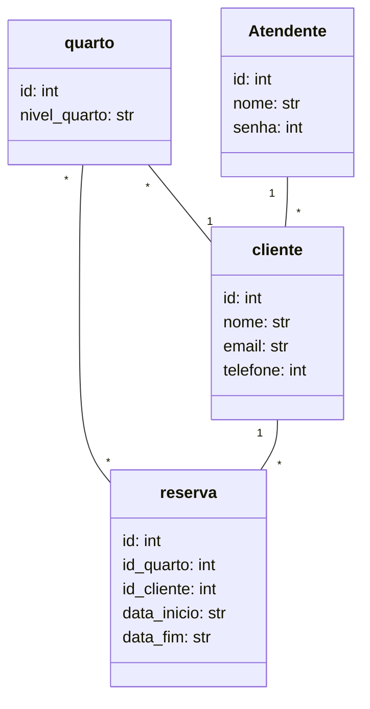

```mermaid
classDiagram
    class reserva{
    id: int
    id_quarto: int
    id_cliente: int
    data_inicio: str
    data_fim: str
}
class quarto{
    id: int
    nivel_quarto: str    
}
class cliente{
    id: int
    nome: str
    email: str
    telefone: int
}
class Atendente{
    id: int
    nome: str
    senha: int
}
cliente "1"--"*"reserva
quarto "*"--"*" reserva
quarto "*"--"1" cliente
Atendente "1"--"*" cliente

```
